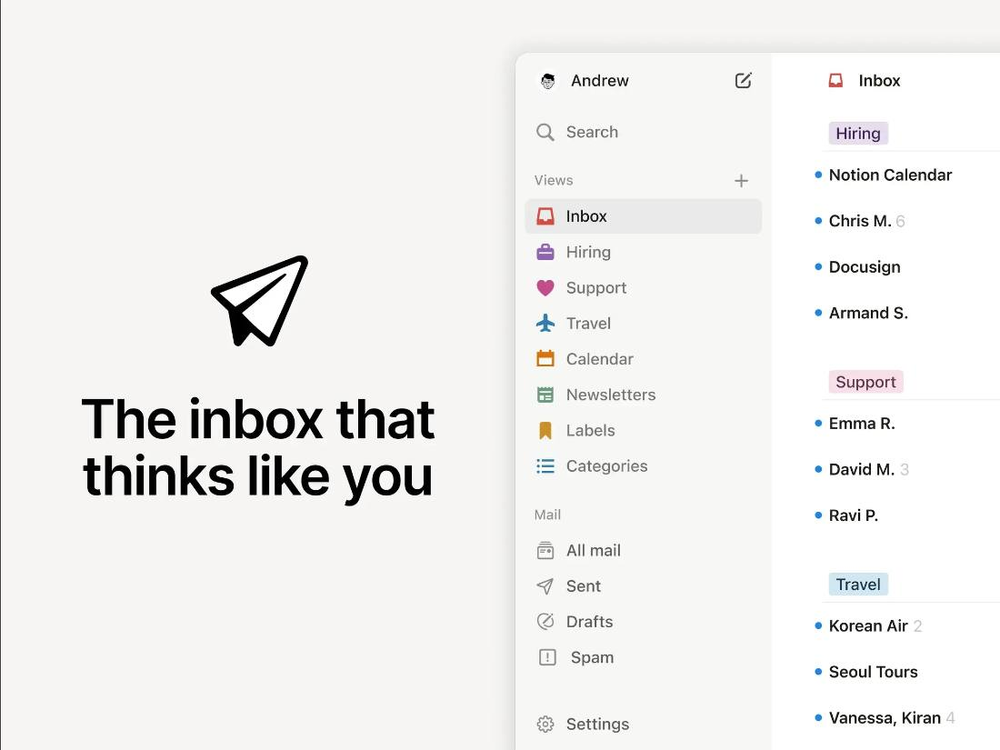
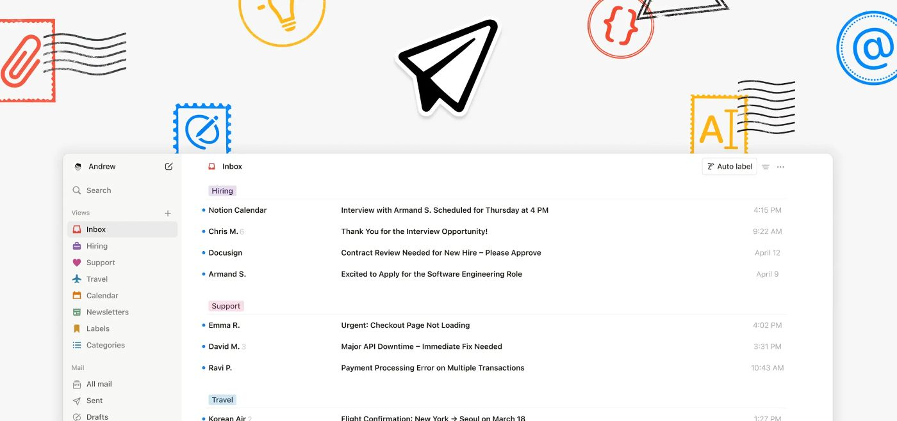
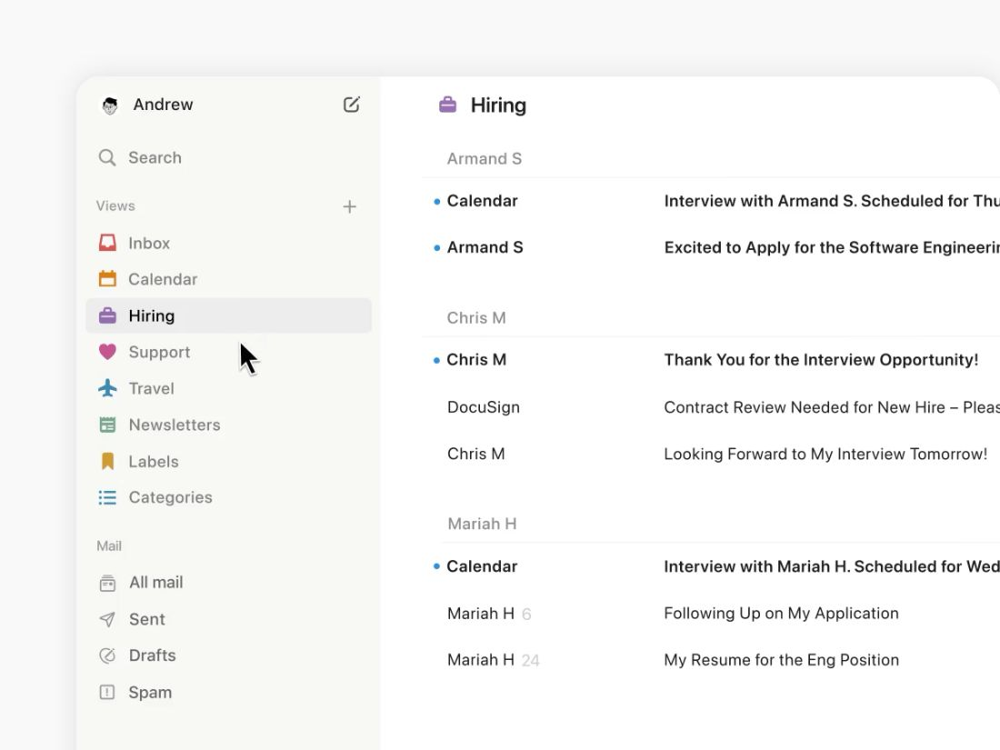
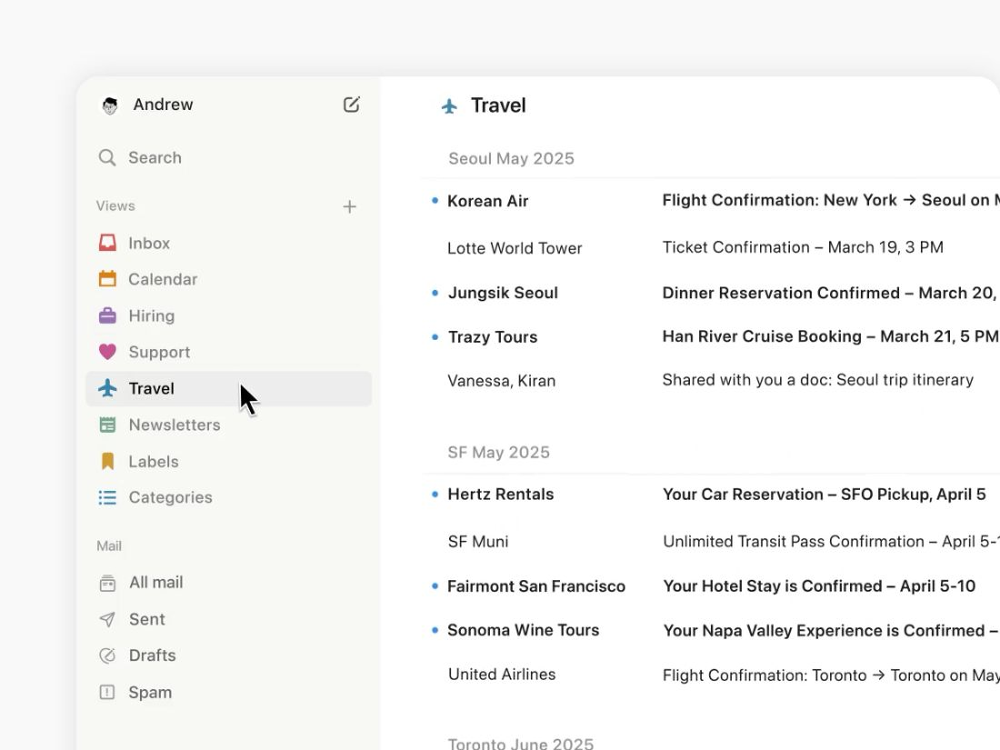
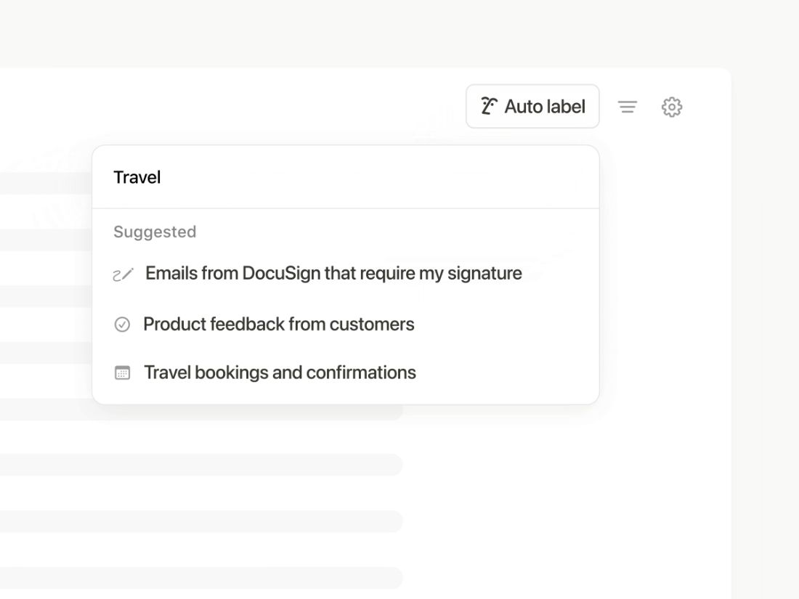
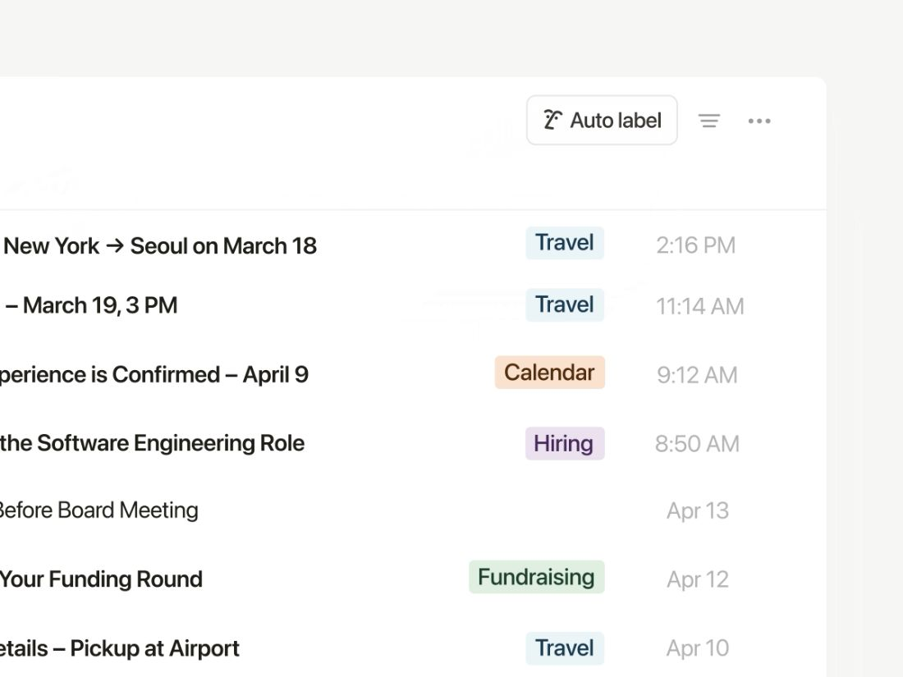
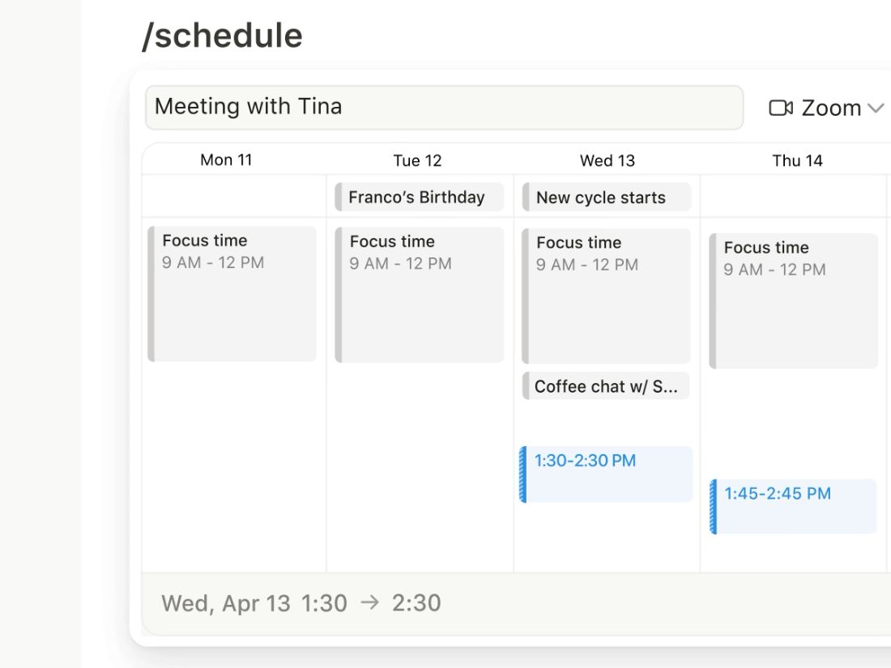
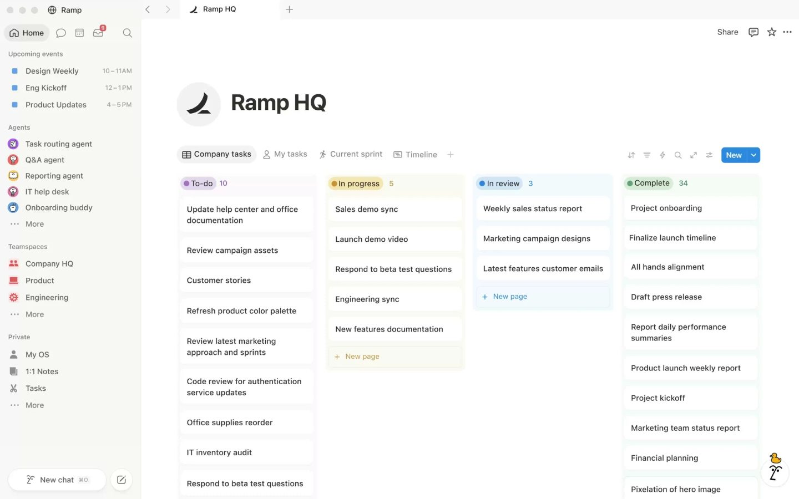
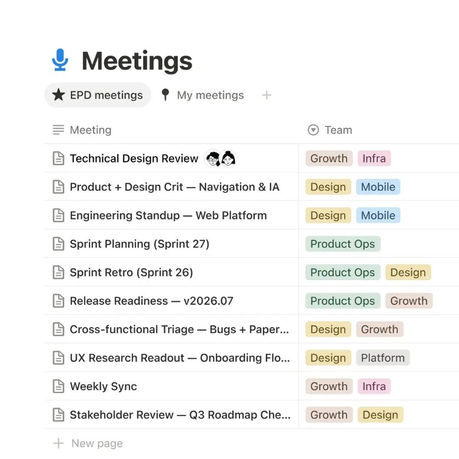
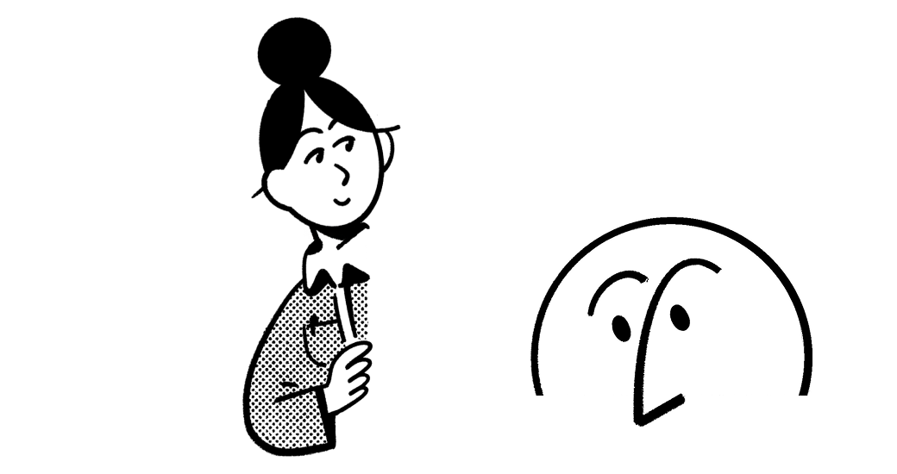

# Notion Mail: research brief (design inspiration only)

**Prepared for:** ZeroLatency, Phase 1 · **Date:** 2026-09-25 · **Sources:** see `sources.md` ([S1]–[S19])

> **Status note.** Notion Mail **shut down on 22 September 2026** ([S6], [S14], [S15]). Its dedicated product page now redirects to the Notion homepage ([S9]). This brief therefore describes the product as documented in its help center, launch materials and reviews, not a live product. As of 2026-09-25 the Mail help articles also redirect to the help-center home in a normal browser, so their text here comes from WebFetch's copies ([S1]–[S6]). The 10 reference images in §12 come from the official launch posts, which are still live ([S7], [S8]), and from the Notion homepage ([S9]).
>
> **Convention.** A sentence ending in a [S#] is a sourced fact. Paragraphs marked *(analysis)* are the researcher's design interpretation for ZeroLatency, not claims about Notion.

---

## 1. What it is

Notion Mail was an AI-assisted email client that sat on top of an existing Gmail or Google Workspace account ([S10], [S16]). Notion launched it on 15 April 2025 as a free app for the web and macOS, with iOS announced as "coming soon" ([S7], [S8], [S12]). Its infrastructure came from Skiff, the encrypted-productivity startup that Notion acquired in 2024 ([S10], [S15]). The premise was to rethink email from first principles: an inbox the user shapes with custom views, natural-language AI labels, reusable snippets and built-in scheduling ([S7], [S8]). Notion retired it in September 2026, saying more than half of its users now handled email through AI agents without opening the inbox ([S14], [S15]).

## 2. Target user

- Existing Notion users and knowledge workers on Gmail who wanted a calmer, more organised inbox. Free Notion users could use it too ([S12], [S13]).
- Zapier's reviewer judged that it served generalists better than power users or specialists ([S11]).
- The launch post framed its use cases around busy individuals, for example a founder handling recruiting email ([S8]).
- It was not built for teams. Reviewers noted there was no shared inbox or team collaboration ([S17]). It supported Google accounts only, never Outlook or iCloud ([S11], [S16]).

## 3. Key features

- **AI auto label.** The user describes a category in plain language and AI labels matching incoming mail. Labelled mail can stay in the inbox or move into its own view ([S2], [S7], [S13]).
- **Custom views.** These are saved inbox slices that combine filters, grouping and visible properties. Default views were generated from the user's existing mail and labels, and new views could start from a template or a suggestion ([S4], [S8]).
- **Group by** date, starred, important, sender email or domain, priority, label, or unread ([S4]).
- **Filters** on read state, attachments, calendar events, sender and recipient fields, subject, and date range ([S4]).
- **Custom properties**, such as a select field used to assign tasks, which can be shown or hidden in the list ([S4]).
- **Write with AI** by pressing space in the composer, with Notion pages @-mentioned as context. **Ask AI** drafts a full reply to a thread ([S2], [S7]).
- **Thread summaries** ([S11]).
- **Snippets**: reusable templates that can include attachments and scheduling links ([S3], [S7], [S12]).
- **Scheduling.** Typing `/schedule` shares availability through Notion Calendar ([S7], [S12]).
- **Block-based composer** with slash commands, Markdown and code blocks ([S7], [S12]).
- **Keyboard-first control**: Gmail-style single-key shortcuts plus a command palette on Cmd+K or Cmd+P ([S1], [S5]).
- **Reminders, labels, archive and mark-unread** on each thread ([S1]). **Hover actions** can be customised ([S11]).
- **Pricing.** The core client was free, and heavier AI use needed a paid AI entitlement ([S10], [S12]). Help docs tie full AI access to Business or Enterprise plans ([S2]). One late review lists an AI add-on at about $8–10 per month ([S17]). *This could not be confirmed on an official pricing page.*

## 4. Information architecture

- **Sidebar, top:** account switcher (settings, switching accounts, logout) and a Compose button ([S1]). Reviewers also mention search and settings there ([S11]).
- **Sidebar, Views:** the user's own views, with "New view" to add one ([S1], [S4]).
- **Sidebar, mail folders:** All Mail, Sent, Drafts and Trash ([S1]). Engadget noted that Drafts and Sent were deliberately given less emphasis ([S12]).
- **Confirmed by the launch imagery** ([S7], [S8]): the sidebar runs top to bottom as account name with a compose icon, then Search, then a "Views" group (header plus a "+" button) with one colored icon per view (Inbox, Calendar, Hiring, Support, Travel, Newsletters, Labels, Categories), then a smaller "Mail" group (All mail, Sent, Drafts, Spam), with Settings pinned at the bottom. The launch images show *Spam* where the help doc lists *Trash*. The folder list probably changed after launch. See `ui-inbox-sidebar-views.png` and `marketing-release-hero-key-art.png`.
- **List-level structure** (images, [S7], [S8]): a view header (icon plus name), grouped sections with a label chip or a quiet gray heading (for example, trip names inside a Travel view), and a toolbar at the top right with an outlined "Auto label" button, a filter icon and an overflow menu.
- **Thread detail** opens as a side peek (right-hand panel, adjustable width), a center peek or a full page, set in Settings ([S1], [S3]).
- **Settings sections:** Inbox (language, theme, thread style, auto-advance, high contrast), Account, Notifications (including per-view and per-sender), Notion AI (auto labels), Gmail Filters, Snippets and Signature ([S3]).
- **Command palette** as a second, keyboard-driven path to every action ([S1], [S5]).
- *(analysis)* The IA copies the core Notion model, where views are just saved queries over one dataset. Folders become secondary, and the "database with views" idea replaces inbox tabs. Zapier made the same point in its own words, saying using it felt like you "never left Notion" ([S11]).

## 5. Layout patterns

**Product UI**
- A two-pane structure: a left sidebar for navigation and views, and a message list, with threads opening in a peek panel over the list or in full page ([S1]).
- The composer was fixed to a side panel with no full-screen mode, which one review criticised for long emails ([S17]).
- Actions show on hover, in a toolbar on the thread, or in an overflow "•••" menu, so rows stay clean by default ([S1], [S11]).
- *(analysis)* The peek pattern keeps the list in view while reading, so the user doesn't lose their place. The layout avoids ribbons and dense toolbars.
- **Confirmed by images** ([S7], [S8]): a fixed-width sidebar in a tinted column next to a white list pane. Each list row reads left to right as unread dot, sender (with a light-gray thread count), subject, optional label chip, then a right-aligned gray timestamp. There are no avatars, checkboxes or preview snippets in the row. The AI auto-label entry point is a floating popover under the toolbar button, with a free-text field above a "Suggested" list of example prompts (`ui-ai-auto-label.png`). Scheduling is an inline week-grid card inside the composer, where busy blocks show as gray and offered slots show as tinted, selectable blocks (`ui-compose-scheduling-link.png`).

**Marketing site**
- The dedicated Mail page is retired and could not be inspected ([S9]). The release notes presented the launch as a hero image followed by one feature image per headline capability: auto label, custom views and scheduling ([S7]). The launch blog followed the same pattern, one screenshot per feature ([S8]).
- The current Notion marketing page follows a familiar sequence: a short headline with two CTAs (free sign-up and demo), a customer-logo wall, three feature pillars, use-case examples, testimonials and a large footer ([S9]).
- **Launch key art** ([S7], [S8]) uses two compositions. One is a split: a big black headline with a line-art icon on the left, and the product window cropped off the right edge on a warm off-white field (`marketing-release-hero-key-art.png`). The other is stacked: playful stamp-style doodle icons above a wide product window that is cut off at the bottom of the frame (`marketing-launch-blog-hero.png`).
- **Notion homepage, measured in the browser at 1440px and 390px** ([S9]):
  - The hero is centered: a two-line headline with one rotating word in a tinted pill, a one-sentence subhead, then a solid primary button next to a pale secondary button.
  - A row of small character avatars sits above the headline. A full-width product visual sits below it, framed by line-drawn characters (`marketing-home-hero-product-visual-desktop.png`).
  - After the hero come a scrolling logo strip, "AI where your team works" with three feature pillars, testimonials, and a closing "Get started today" CTA with a stats ticker and character illustrations (`marketing-home-cta-accent-illustrations.png`).
  - At 390px the hero product visual is dropped. The headline wraps to four lines, and the two CTAs stack as full-width buttons. Feature visuals switch to square crops made for mobile (`marketing-home-feature-visual-mobile.png`).
- *(analysis)* The pattern to borrow is a **one-idea-per-section** rhythm: a short headline, one supporting line, then one large product visual that is often cropped by the frame, so it reads as a window into the product rather than a full screenshot.

## 6. Typography feel

- The parent brand pairs a classical serif logotype with a restrained, monochrome identity ([S19]). The product UI is described as mirroring Notion's minimal aesthetic ([S11]).
- **Confirmed by images** ([S7], [S8]): the Mail UI is set entirely in a neutral grotesque sans. Weight carries state: **unread rows are bold** (sender and subject) and read rows are regular. Group headings, the "Views" and "Mail" section headers, counts and timestamps are smaller and gray, not bolder. The key-art headline is a heavy sans set tightly, not a serif.
- **Measured on the Notion homepage** ([S9], browser computed styles at 1440px):
  - The hero headline is about 96px, semibold, with tight negative letter-spacing and a line height close to 1.0.
  - Section headings are about 54px bold (about 42px for the closing CTA), and the subhead is 20px regular. Buttons use 16px text.
  - At 390px the hero headline shrinks to about 42px and headings to about 32px.
  - The stack is a customised Inter-family sans with system fallbacks (not to be copied; ZeroLatency picks its own).
  - The size ratio from hero headline to body is roughly 5:1 on desktop and 2:1 on mobile.
- *(analysis)*: This confirms that the calm feel comes from a single sans family with large size contrast on marketing pages, and from weight-only emphasis inside the product. Serif appears only in the brand mark ([S19]). **ZeroLatency should choose its own type pairing and not reproduce Notion's fonts.**

## 7. Color usage

- The parent brand is essentially black-and-white. Its visual identity grew out of the utilitarian software UI ([S18], [S19]).
- The UI offers light, dark and system themes, plus a high-contrast mode ([S3]).
- Notion's 2024 brand campaign added playful primary-coloured illustration to its marketing, a deliberate contrast with the austere product ([S18]).
- **Confirmed by images** ([S7], [S8], [S9]): the product sits on a white work surface, with a warm off-white sidebar and marketing backdrop. Text is near-black, and secondary information (timestamps, counts, group headings) uses mid and light warm grays. Dividers are hairlines. Unread state is a small saturated blue dot. The selected view is a soft gray fill, not a colored highlight. Offered time slots in the scheduler are pale blue tints.
- **Correction to the earlier analysis:** the product uses *more* color than "one restrained accent". Each view has its own **small, fully saturated icon** (red, orange, purple, pink, blue, green, yellow), and labels are **pastel tinted chips** with dark text in the same hue family (`ui-auto-label-result.png`). The rule is really "many hues, but always small or desaturated, never large fills". Marketing art adds bright primary-colored doodles and black line characters ([S8], [S18]). On the homepage, the primary CTA is a solid mid-blue and the secondary CTA is a pale blue tint ([S9]).
- *(analysis)*: ZeroLatency can use a near-white canvas with warm neutrals, one primary action color, and a small categorical palette for labels and views. Those label colors appear only as icons, dots or tinted chips. **No Notion color values are recorded here on purpose.**

## 8. Spacing and density

- Reviewers call the UI clean, minimal and less cluttered than Gmail ([S11], [S17]). Engadget described the design intent as "lightweight" ([S12]).
- Users can hide or show properties in the list, so density is under their control ([S4]).
- **Confirmed by images** ([S7], [S8]):
  - List rows are single-line, and each has only sender, subject, optional chip and time, with no preview text. Rows sit at a relaxed height of roughly 2.5–3× the text size.
  - Groups are separated by a large gap plus a hairline, not by boxes or cards. The sidebar sits in a slightly tinted column with roomy item spacing, and section headers in the sidebar get extra space above them.
  - The app window uses large corner radii and a very soft shadow when shown in marketing.
- **Homepage** ([S9]): buttons are compact (about 36px tall on desktop and 38px on mobile, with small radii of about 4–8px). The hero and sections sit on generous vertical whitespace, and content is centered in a narrow column.
- *(analysis)*: The density is "medium-relaxed". There is enough air that each row reads as one clear item, but no preview lines, so a view still shows 10 or more threads at once.

## 9. Motion

- None of the sources document animation specs. The only documented motion-related behaviour is structural: threads open in a side or center peek over the list, and auto-advance moves to the next or previous thread after an action ([S1], [S3]).
- The launch assets are short looping GIFs that demonstrate one interaction each: typing an auto-label prompt and watching chips appear, a cursor moving between views, and picking slots in `/schedule` ([S7], [S8]). The homepage hero uses a looping product video and a rotating keyword in the headline ([S9]). The PNGs in §12 are single frames taken from these loops.
- *(analysis)*: Motion should work as a functional hint, not decoration. That means short slide or fade transitions for peek panels, instant list updates after archiving, and no bouncing or parallax.

## 10. Tone of voice

- The launch post opened with the question of what email might look like if it were designed from scratch today. It promised software that stays out of the way, humming "in the background" ([S8]).
- The voice is conversational and aspirational, and features are explained through everyday scenarios rather than specifications ([S8]).
- The product lead stressed that users could configure the product in ways the team hadn't anticipated ([S10]). The team explicitly rejected inbox-zero guilt ([S12]).
- Help docs are plain, second person and task-oriented. They name the UI element, then the action ([S1], [S4]).

## 11. Why it feels calm and minimal

*(analysis, grounded in the cited facts)*
1. **Personal structure replaces imposed structure.** Views and AI labels mirror the user's own priorities, so the inbox shows less at once ([S4], [S8]).
2. **Controls appear only when needed.** Actions sit behind hover, the "•••" menu and the command palette ([S1], [S5], [S11]).
3. **Secondary areas recede.** Drafts and Sent are downplayed, and the product doesn't push an inbox-zero target ([S12]).
4. **A monochrome canvas** leaves color for meaning ([S18], [S19]).
5. **Peek panels keep context**, so the user rarely does a full page change ([S1]).
6. **Copy is short and friendly**, with no urgency or gamification ([S8]).

## 12. Screenshot index

**10 PNGs** are in `research/screenshots/`. They were captured on 2026-09-25 through the user's in-app browser, because the cloud sandbox's egress blocks notion.com. Each file is an **official image asset** fetched from a live notion.com page and converted to PNG. GIF demos were saved as a single frame, and large images were downscaled to at most 1440px wide. They are internal research references only and must **never** be used on the ZeroLatency site.

Limits:
- **No page-level screenshots.** Notion's Content Security Policy blocked loading html2canvas, and the browser tool can't save its own screenshots to disk. The homepage hero and CTA are therefore represented by their image assets, and their layout is described from live inspection and computed styles in §5–§8.
- **No help-center images.** Every Mail help article, including the auto-labeling guide, now redirects to the help-center home (checked in the browser for 9 URLs), so their embedded UI images (settings, shortcuts, mobile) are no longer reachable. Views, compose and AI are covered by the launch-post images instead.

| File | What it shows | Source |
|---|---|---|
| `marketing-release-hero-key-art.png` | Launch key art: headline on the left, product window with the full sidebar (views, mail folders, Settings) on the right, warm off-white field | [S7] |
| `marketing-launch-blog-hero.png` | Blog hero: stamp-style doodle icons above a wide inbox window with grouped label sections and the Auto label toolbar | [S8] |
| `ui-inbox-sidebar-views.png` | Inbox with sidebar and a "Hiring" view grouped by sender, unread dots, bold unread rows | [S8] |
| `ui-custom-views.png` | "Travel" custom view grouped by trip, with the sidebar's colored view icons | [S7] |
| `ui-ai-auto-label.png` | AI auto-label popover: free-text prompt plus "Suggested" examples | [S7] |
| `ui-auto-label-result.png` | List after auto-labelling: pastel label chips and gray timestamps | [S8] |
| `ui-compose-scheduling-link.png` | `/schedule` in the composer: inline week grid with busy and offered slots | [S8] |
| `marketing-home-hero-product-visual-desktop.png` | Notion homepage hero product visual (1440-wide asset shown under the centered hero). Parent brand, not Mail | [S9] |
| `marketing-home-feature-visual-mobile.png` | Homepage feature visual in its mobile (≤839px) square crop | [S9] |
| `marketing-home-cta-accent-illustrations.png` | The two character illustrations that frame the homepage's closing CTA, placed side by side (assets only, not the rendered section). **Reference for "do not copy"** | [S9] |

## 13. Design principles to borrow

Each is stated as a transferable principle, not a visual to copy.
1. **Let users define the structure.** Make saved views and natural-language rules the main way to navigate, and make folders secondary.
2. **Keep controls quiet until they're needed.** Rows stay clean. Actions appear on hover or focus, in one overflow menu, or in a command palette.
3. **Make the keyboard a first-class path.** Offer single-key actions and a searchable command palette that lists every command with its shortcut.
4. **Preserve context.** Open details in a side panel over the list, with a user choice of side, center or full-page reading.
5. **Keep a neutral canvas and use color only for meaning.** Use one accent for the primary action, and reserve other hues for status and labels.
6. **Put AI where the user already is.** Invoke it inline in the composer, or with one action on a thread, instead of in a separate chat surface.
7. **Use calm copy.** Keep sentences short and friendly, avoid urgency and gamified goals, and explain features through real scenarios.
8. **One idea per marketing section.** Pair a short headline and one supporting line with one large product visual, and leave generous vertical space.
9. **Treat accessibility as part of the product.** Offer system, light and dark themes plus a high-contrast option from day one.

## 14. What NOT to copy

- The **Notion name**, the "Notion Mail" product name, and any "N" mark, logo, wordmark or app icon.
- The **serif logotype** and any custom Notion typefaces. Pick licensed or open fonts of our own.
- **Illustrations and characters**, including the hand-drawn character art and the 2024 primary-coloured campaign style ([S18]). Commission or create original visuals. This also covers the Mail launch's postage-stamp doodle icons and paper-plane mark (`marketing-launch-blog-hero.png`) and the homepage's line-drawn characters (`marketing-home-cta-accent-illustrations.png`).
- **Icon sets and emoji-style icons** used in Notion's UI and help docs.
- **Exact color values**, theme palettes and label-chip colors. ZeroLatency derives its own tokens.
- **Marketing copy, headlines and taglines** (for example, the launch headline of an inbox that thinks like you), feature names used as brand terms ("Auto label", "Side peek", "Center peek", "Ask AI"), and help-doc text.
- **Screenshots and product imagery**, even as placeholders on the live site. They are internal references only.
- **Customer logos, testimonials and trust claims** (for example, Forbes Cloud 100 statistics) ([S9]).
- Exact page layouts copied pixel for pixel. Borrow the principles, not the compositions.

## 15. Recommended SITE_PURPOSE for ZeroLatency

**Options**
- **A. Marketing landing site for an AI-first email client** (hero, features, AI section, pricing, waitlist CTA). This is the closest match to the research.
- **B. Marketing site for an "inbox agent"**: a product that triages, labels and drafts email in the background, so the inbox becomes optional. This follows the reason Notion gave for shutting Mail down ([S14], [S15]).
- **C. Design-system showcase** (a documentation site for the ZeroLatency design system). It's useful, but it has no product story.

**Recommendation: B, an agent-first email assistant landing site** (it still uses Option A's section layout). *Rationale:* Notion itself retired its standalone inbox because users moved to agents ([S14]), so positioning ZeroLatency around speed and delegation, where a plain inbox app is not the point, is more credible in 2026 and fits the "zero latency" name.

- **Target audience:** Founders, operators and other busy professionals on Gmail or Google Workspace (Outlook later) who get 100+ emails a day and want replies handled fast without living in the inbox.
- **One-line value proposition (placeholder):** "Email handled at the speed you think: ZeroLatency sorts, drafts and schedules so you only see what needs you."
- **Pricing tiers (placeholder, not market-validated):**
  | Tier | Price | Includes |
  |---|---|---|
  | Free | $0 | 1 account, basic views and rules, limited AI actions per month |
  | Pro | ~$12 per user per month | Unlimited AI triage and drafts, snippets, scheduling links, priority support |
  | Team | ~$20 per user per month | Shared rules and views, admin controls, SSO, audit log |
